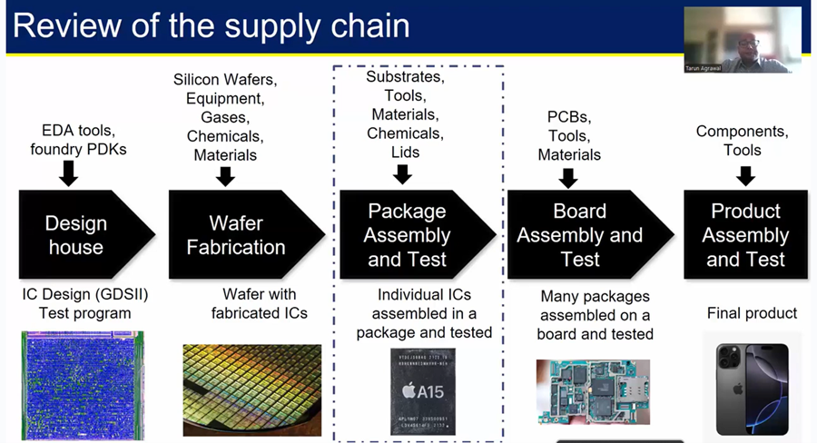
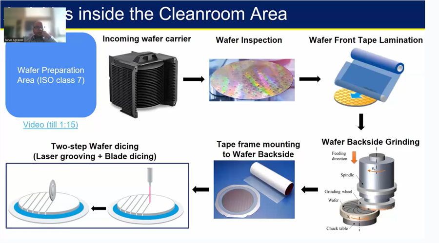
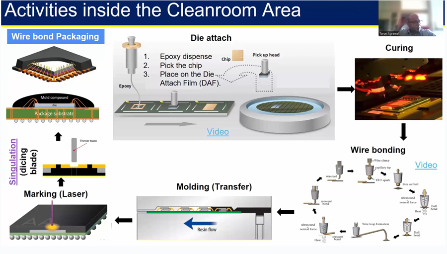
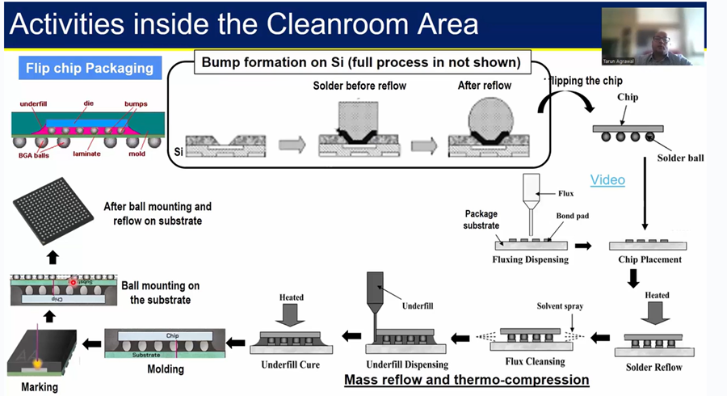
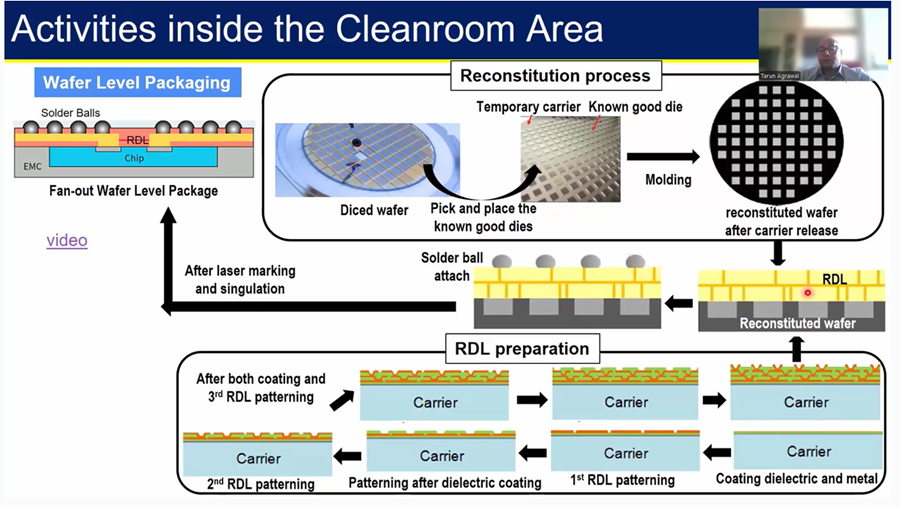

# 🧠 End-to-End Semiconductor Assembly Pipeline

A seamless transformation from bare silicon to a packaged IC requires coordinated stages, each demanding precision equipment and stringent environmental control.

## 📌 Pipeline Overview

  
Design Verification & Tape-Out

**Inputs**: EDA tool streams, Process Design Kits (PDKs)  
**Deliverables**: GDSII layout, validation scripts

  
Wafer Fabrication

**Inputs**: Prime-grade Si wafers, photolithography tools, process chemistries  
**Deliverables**: Patterned wafers housing thousands of dies

  
ATMP (Assembly, Test, Mark & Package)

**Inputs**: Substrates, bonding materials, encapsulants  
**Processes**: Dicing, die-attach, wire/flip-chip bonding, encapsulation, electrical test

  
PCB-Level Assembly & Validation

**Inputs**: Populated PCBs, reflow ovens, inspection stations  
**Outputs**: Verified system boards

  
Final System Integration

**Inputs**: Board-level assemblies, mechanical enclosures  
**Outputs**: Turnkey electronic products (e.g., smartphones, servers)

---

## 🏭 Anatomy of an ATMP Facility

Outsourced Semiconductor Assembly & Test (OSAT) hubs—or in-house ATMP wings at IDM fabs—are structured into specialized zones:

- **Material Preparation**: Staging of substrates, adhesives, molding compounds  
- **Cleanroom Assembly (ISO 6/7)**:
  - Die-Bond: Epoxy dispensing, pick-and-place
  - Cure: Solidify epoxy with thermal profiles
  - Wire Bond: Ball/wedge bonding, loop shaping
  - Encapsulation & Marking: Transfer-molding, laser engraving
  - Singulation: High-speed sawing
  - Electrical Test & Burn-In: Parametric tests, thermal stress
  - Packaging & Dispatch: Tape-and-reel, trays, labeling

> 🏗️ *Example: Micron’s Sanand facility spans 500,000 sq.ft. of Class 1000/10000 cleanroom.*

---

## 🌀 Wafer Pre-Processing

  
Steps Overview

- **Carrier Unloading & EPI Inspection**  
- **Front-Side Protective Tape Lamination**  
- **Backside Thinning via Grinding**  
- **Frame Mounting**  
- **Laser Scribe & Blade Dicing**

---

## 🔩 Wire-Bond Packaging Workflow

  
1. Die Attach & Cure

- **Epoxy Jet Dispense**: Sub-10 nL droplets  
- **Pick-&-Place**: ±2 µm precision  
- **Thermal Cure**: 150 °C for 90 s

  
2. Wire Bonding

- **Ball Formation**: EFO spark  
- **Bonding Sequence**: Ball-to-pad, stitch bond  
- **Loop Control**: Shape and height optimized

  
3. Transfer Molding & Marking

- **Molding Press**: 300 bar @ 175 °C  
- **Laser Ablation**: 355 nm UV laser

  
4. Singulation & Debris Control

- **Precision Sawing**: <30 µm kerf  
- **Ionized Air Curtains**: Debris removal

---

## 🔃 Flip-Chip Assembly Steps

  
1. Bump Formation

- Electroplating SnAgCu (~80 µm)
- 

  
2. Flip & Align

- Sub-1 µm vision-guided placement

  
3. Reflow Soldering

- Nitrogen peak: 245 °C

  
4. Underfill & Cure

- Capillary infiltration, cure @ 125 °C

  
5. Molding, Marking, Ball Mount

- Glob-top, laser coding  
- BGA attach and inert-atmosphere reflow

---

## 🌐 Wafer-Level Packaging (WLP) & RDL

  
1. Reconstitution & Mold

- Die sorting onto carrier wafers  
- Epoxy encapsulation to reconstitute wafer

  
2. RDL Build-Up

- Spin-coating PI/BCB  
- Cu sputter & lithography  
- Up to 5 routing layers

  
3. Ball Array Creation

- Cu pillars, SAC305 caps  
- Reflow for adhesion
- 

  
4. Singulation & Inspection

- Laser/blade dicing  
- AOI & X-ray analysis

---
