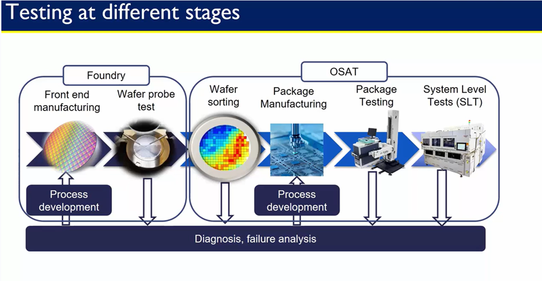
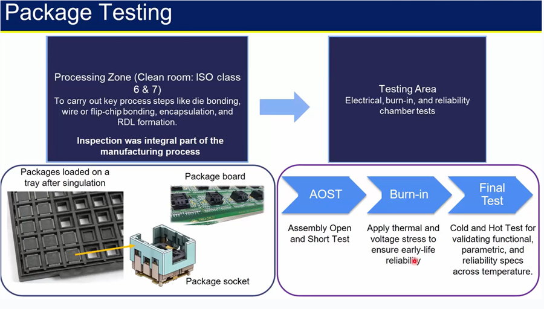
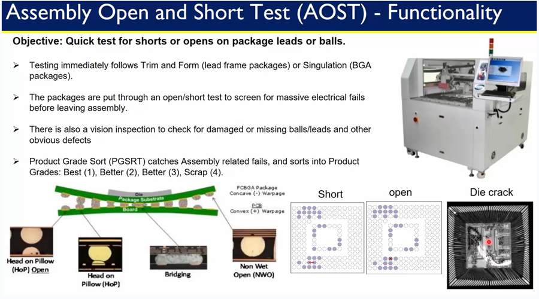
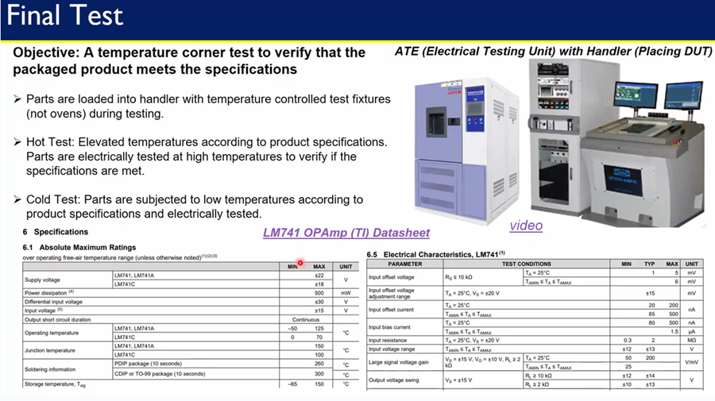

# 🔍 Advanced Package Reliability Verification

> A robust semiconductor package reliability program integrates multi-level electrical and environmental stress tests—conducted at both wafer fabs and OSAT hubs—to guarantee functional integrity and long-term durability.

---

## 🏭 1. Foundry-Level Validation Workflow

  
📊 1.1 Front-End Process Qualification

- **PCMs (Process Control Monitors)**: Embedded for real-time yield and parametric monitoring  
- **SPC (Statistical Process Control)**: k-control limits for lithography and etch precision

  
🔬 1.2 Wafer Probe & Sort

- **Parametric Wafer Test**: High-frequency vector tests for threshold shifts, leakage, and timing  
- **Die Map Creation**: Defect tagging and binning for automation

---

## 🧪 2. OSAT-Level Assembly & Electrical Screening

  
📏 2.1 Post-Package AOST (Assembly Open/Short Test)

- **Continuity Checks**: CV scans detect opens/shorts  
- **AVI**: 5 µm resolution inspection for defects like HoP, NWO, bridging, and voids  
- **PGSRT Binning**: Grades 1–4 enable strategic device sorting
- 

  
🔥 2.2 Burn-In Stress Screening

- **Thermal-Voltage Acceleration**: 125 °C @ 1.3× V_DD  
- **Dynamic Burn-In**: Looping test vectors to simulate real-world load  
- **Failure Analysis Feedback**: Burnt samples aid root-cause improvements

  
🧪 2.3 Final Functional & Parametric Testing

- **Chamber Testing**: From –40 °C to +85 °C  
- **ATE Execution**: Functional, scan, memory BIST, and BIST routines  
- **Parallel Testing**: Faster throughput with multi-site handlers and spy patterns
-  

---

## ⚙️ 3. ATE-Driven Quality Assurance

   
  
🔌 3.1 Parametric & Functional Test Coverage

- **IDDQ/IDD**: Current-based leakage detection  
- **PVT Dynamic Timing**: Critical path delays under environmental stress

  
🌪️ 3.2 Multi-Environment Reliability Tests

- **HALT**: Thermal/vibration/mechanical stress for grading  
- **HASS**: Compound stress to eliminate latent weaknesses

---

## 📈 4. Continuous Improvement & Metrics

  
📊 Yield & Efficiency Monitoring

- **DPPM Tracking**: Yield trends across test nodes  
- **Screening Efficiency**: Test coverage vs. cycle time tradeoffs  
- **Root Cause Analysis**: Feedback loop via FA to tune upstream stages
-  

---

