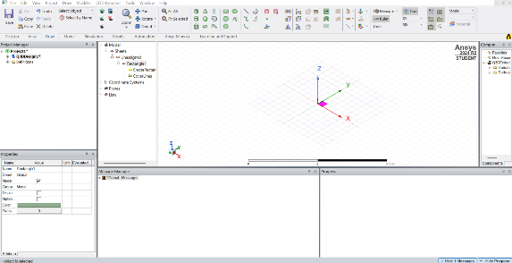
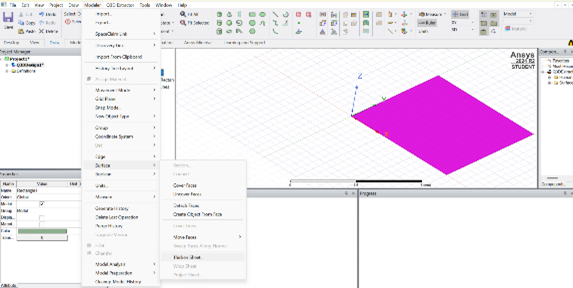
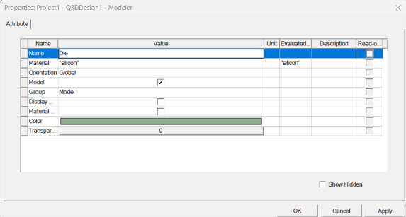
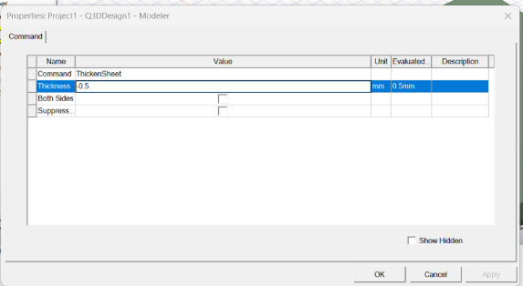
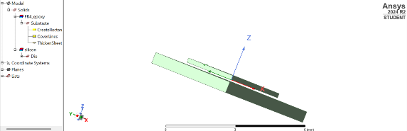
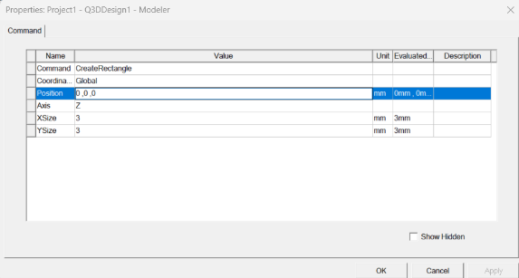
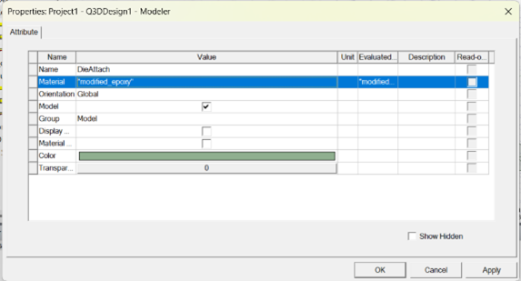
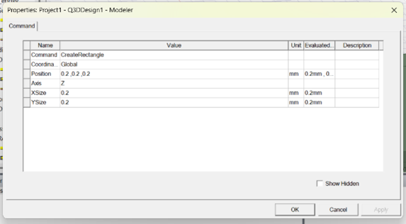
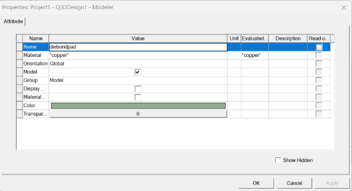
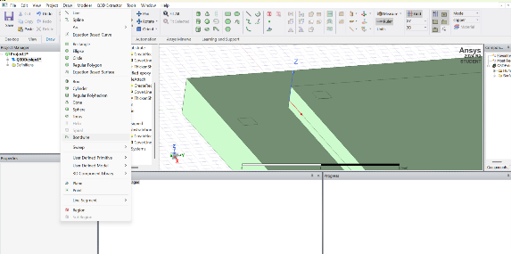

# 🧰 Packaging Module 5

This module walks through the steps for setting up a basic semiconductor package, including die pad configuration, bond pad creation, wire bonding, and mold compound encapsulation.

---

<strong>📐 Define Angle for Die Pad Representation</strong>

Specify the angle to represent the die pad.

<strong>📏 Set Die Thickness</strong>

Set the thickness to:

<strong>🔗 Add Bond Pads</strong>

- Create bond pads on both the die and the substrate.
- These serve as electrical connection points for wire bonding.
- Assign appropriate material properties, typically metallic:
  - **Gold**
  - **Aluminum**

<strong>🔌 Establish Wire Bond Connections</strong>

- Use the **Bondwire** tool.
- Connect die pads to substrate pads using **gold wire**.

<strong>📦 Incorporate Mold Compound</strong>

- Add a rectangular mold compound structure to encapsulate:
  - The die
  - Associated wire bonds
- Set the thickness to:
  
- Assign mold material properties such as:
  - **Epoxy Molding Compound**

---

## 📸 Simulation Steps

><table>
  <tr>
    <td></td>
    <td></td>
    <td></td>
    <td></td>
  </tr>
  <tr>
    <td></td>
    <td></td>
    <td></td>
    <td></td>
  </tr>
  <tr>
    <td></td>
    <td></td>
    
  </tr>
  </table>

---

## 🛠️ Tools Used

- Bondwire tool (for wire bonding)
- CAD/EDA tool for die and substrate modeling

---
